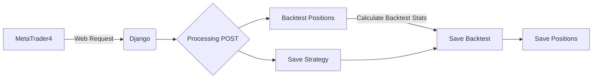
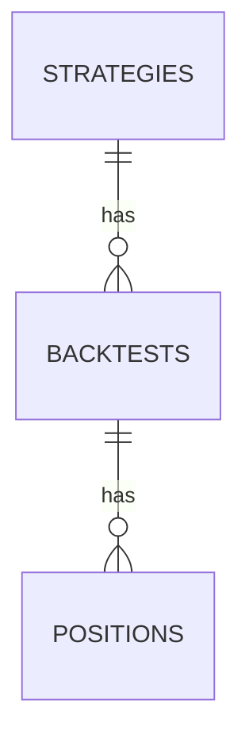

# DjangoREST

Tykee REST microservice using Django and Postgres.


## Setup

### Pre-requisites

- Python 3.10
- Postgres 15.0

### Installation

In my experience the best way to work with backend is to first write schema and initailize the database. This is done by running the following command:

```bash
psql -U postgres -d postgres -a -f schema.sql
```

_Script `schema.sql` can be found under `tykee\postgres`._

This will create a new Postgres database with following credentials:
* Database name: `tykee`
* Username: `tykee`
* Password: `tykee`

After the database is created, set up a new virtual environment and install all the dependencies:

```bash
pip install -r requirements.txt
```

## Business Logic

In this DEMO repository, I have implemented the following business logic:



The following is a brief description of each step:
1. MetaTrader4 sends a POST request to the Django REST API.
    ```json
    {
      "strategy_name": "",
      "backtest": {},
      "positions": []
    }
    ```
   
2. The Django REST API saves the strategy if it's new model.
3. Before saving Backtest results, we must calculate few statistics from positions, like
    * Profit and Profit Factor
    * Maximum Drawdown
    * Total Trades
    * Win Rate

4. Save the new backtest.
5. Pass backtest object to positions and save positions.

### Main Entity Relationship Diagram

